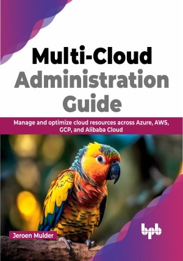

# Multi-Cloud Administration Guide

A comprehensive guide to Multi-Cloud Administration for Cloud professionals

This is the repository for [Multi-Cloud Administration Guide
](https://bpbonline.com/products/multi-cloud-administration-guide?variant=42851028926664),published by BPB Publications. 

## About the Book
In today's landscape, organizations are embracing multi-cloud strategies to harness the advantages offered by multiple cloud providers. If you want to develop the necessary skills and expertise in managing multi-cloud environments, then this book is tailor-made for you.

This is a comprehensive guide that equips you with the knowledge and skills needed to manage multiple cloud environments effectively. The book begins by exploring the Cloud Adoption Frameworks, providing a solid foundation for understanding multi-cloud strategies. It then covers topics such as virtualizing and managing connectivity, storage, and compute resources across different clouds. The book also discusses creating interoperability, managing data in a multi-cloud environment, and building and operating cloud-native applications. Lastly, it covers containerization, serverless computing, access management, security, and automating compliance.

By the end of the book, you will be equipped with the necessary knowledge and skills to confidently navigate the complexities of multi-cloud administration.

## What You Will Learn
•  Gain expertise in efficiently managing applications, data, and environments within multi-cloud platforms.

•  Familiarize yourself with the setup and management of cloud-native technologies.

•  Learn how to implement robust security measures for cloud platforms.

•  Understand the importance of maintaining compliance and adhering to regulatory standards.

•  Develop strategies for achieving seamless interoperability in a multi-cloud environment.
